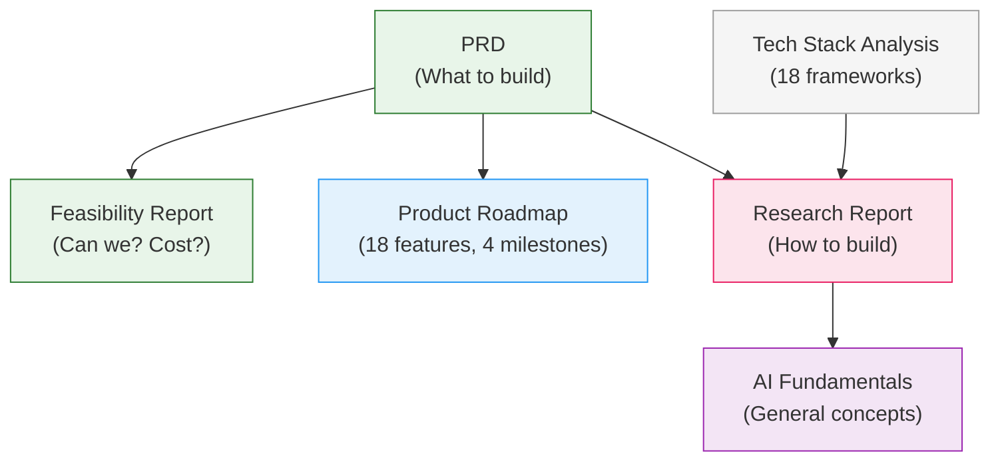

# OpenWT Employee Co-Pilot — Documentation

*Last updated: 2026-04-08*

## Project at a Glance

| | |
|---|---|
| **What** | AI chat assistant embedded in Employee App (employee.openwt.vn) |
| **Who** | ~200 OpenWT employees |
| **Stack** | Mastra + CopilotKit + Claude + PostgreSQL + Redis + Docker Compose |
| **MVP** | 6 features: leave balance, history, WFH, policy Q&A, submit leave, Vision AI |
| **Timeline** | MVP 2-3 weeks (1 developer) |
| **Cost** | ~$50-100/month (Claude API + OpenAI embeddings) |
| **Roadmap** | 18 features across 4 milestones |
## Reading Order

| # | Document | What it answers | Time |
|---|----------|----------------|------|
| 1 | [PRD](core/m1-prd.md) | What + why + tech decisions (MVP scope, user flows, edge cases, decisions log) | 10 min |
| 2 | [Feasibility Report](core/m1-feasibility.md) | Can we build it? How long? How much? (build sequence, Step 0 checklist) | 5 min |
| 3 | [Product Roadmap](core/product-roadmap.md) | What comes after MVP? (4 milestones, 18 features, module coverage) | 10 min |
| 4 | [Research Report](core/research-report.md) | How do we build it? (tool schemas, auth, Docker, RAG, guardrails) | 30 min |
| 5 | [AI Agent Fundamentals](core/ai-agent-fundamentals.md) | What are agents, memory, RAG, guardrails? (general concepts) | 20 min |

## Directory Structure

```
docs/
├── README.md                    ← You are here
│
├── core/                        ← Main project documents
│   ├── m1-prd.md                   ← Product Requirements Document
│   ├── research-report.md       ← Technical research (10 sections)
│   ├── m1-feasibility.md    ← Phase 1 build order + cost
│   ├── product-roadmap.md       ← 4-milestone feature roadmap
│   └── ai-agent-fundamentals.md ← AI agent concepts reference (11 sections)
│
├── references/                  ← External sources + analysis
│   ├── tech-stack-analysis.md   ← 18 AI frameworks comparison
│   └── DN TechCafe *.pdf        ← KMS TechCafe slides (source material)
│
├── archive/                     ← Historical, superseded by core/
│   ├── ideas.md                 ← Original brainstorming (superseded by PRD)
│   ├── draft_plan.md            ← Original draft plan (superseded by feasibility)
│   └── council-decisions.md     ← Original council debate (merged into PRD Decisions Log)
│
└── images/                      ← Employee App screenshots
    ├── image_1.png              ← My Devices page
    ├── image_2.png              ← Attendance Overview
    ├── image_3.png              ← Vacation Balance + Request History
    └── image_4.png              ← WFH Requests
```

## Document Map



## Quick Links

| Need to... | Go to |
|-----------|-------|
| Understand the product | [PRD](core/m1-prd.md) |
| See the build timeline + Step 0 checklist | [Feasibility Report](core/m1-feasibility.md) |
| Know why Mastra over LangChain | [PRD — Decisions Log](core/m1-prd.md#decisions-log) |
| See what's after MVP | [Product Roadmap](core/product-roadmap.md) |
| Find tool schemas, auth code, Docker config | [Research Report](core/research-report.md) |
| Learn about RAG, memory, guardrails | [AI Fundamentals](core/ai-agent-fundamentals.md) |
| Compare 18 AI frameworks | [Tech Stack Analysis](references/tech-stack-analysis.md) |

## Milestone Overview

| Milestone | Focus | Features | Effort |
|------|-------|----------|--------|
| **1 (MVP)** | Leave + Policy + Vision AI | 6 | 2-3 weeks |
| **2 (Expand)** | All remaining modules (read) + Slack | 8 | ~2-3 weeks |
| **3 (Workflows)** | Task Manager (write operations) | 1 | ~1-2 weeks |
| **4 (Intelligence)** | Analytics, Knowledge Search, Notifications | 3 | ~7-10 weeks |
