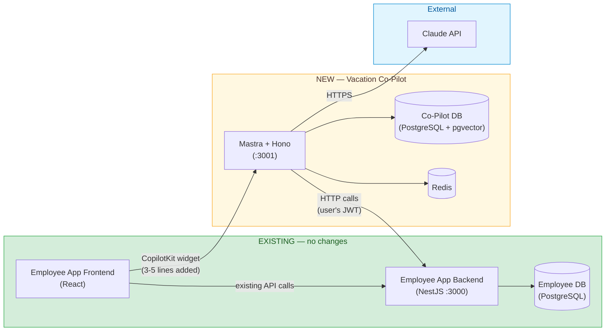
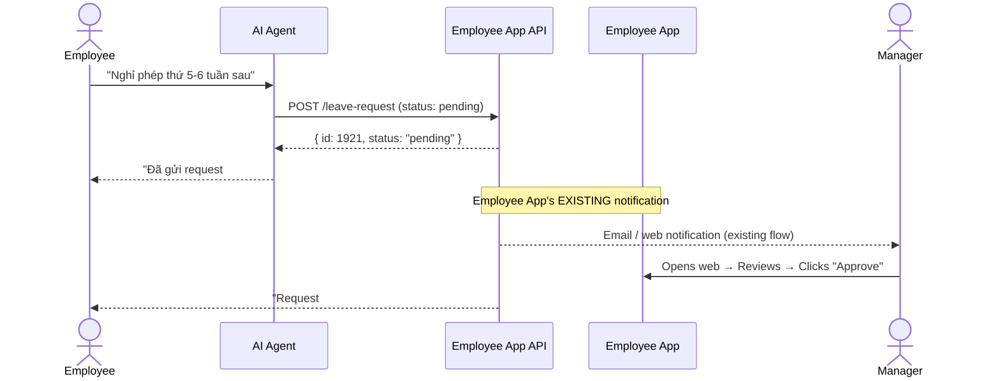
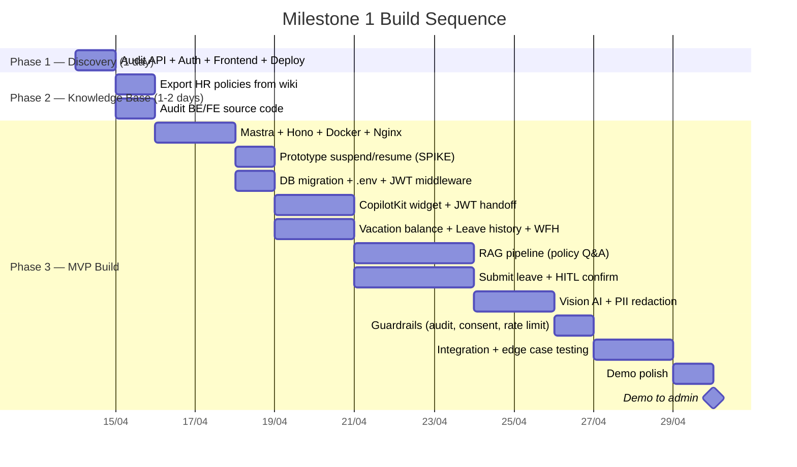
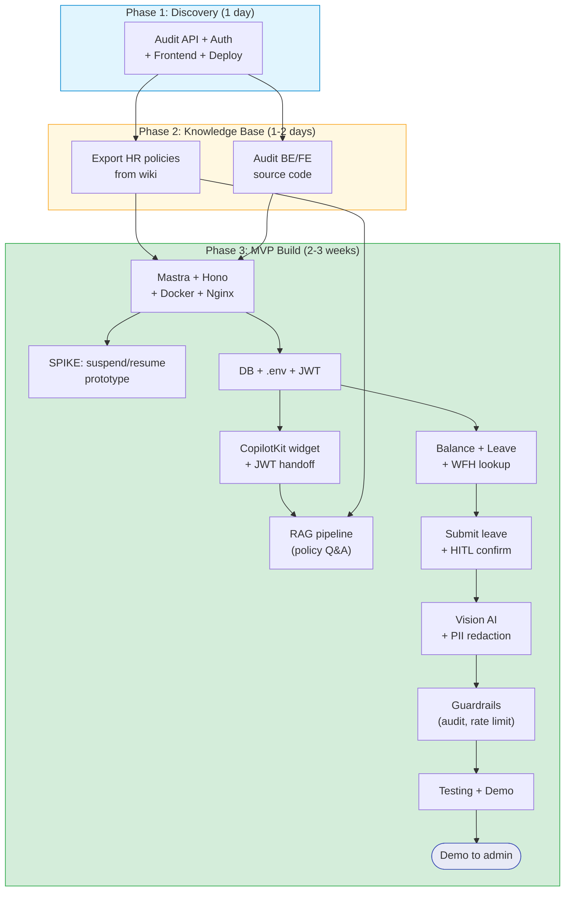
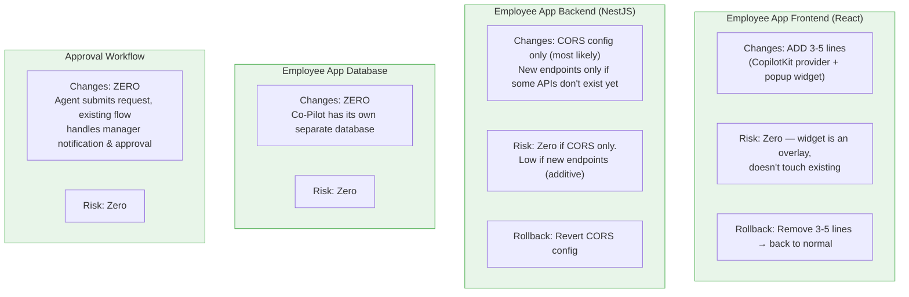

# Milestone 1 Feasibility: OpenWT Vacation Co-Pilot — MVP

*Generated: 2026-04-07 | Updated: 2026-04-08*

### Verdict: **Highly feasible.** Proven stack, low cost, 2-3 weeks for focused MVP (leave + policy + Vision AI).

---

## Tech Stack

| Component | Choice | Why |
|-----------|--------|-----|
| Agent Framework | **Mastra** (v1.3, TypeScript) | Built-in tools, RAG, durable workflows |
| HTTP Server | **Hono** (bundled with Mastra) | Lightweight, no NestJS conflict |
| Chat Widget | **CopilotKit** | Official Mastra integration, embeds into React |
| LLM | **Claude Haiku** (chat) + **Sonnet** (Vision) | Best Vietnamese support |
| Database | **PostgreSQL + pgvector** | AI memory, audit logs, RAG embeddings |
| Cache | **Redis** | Policy FAQ cache, conversation state |
| Deployment | **Docker Compose** (on-premise) | HR data sensitivity |

---

## Changes Required to Existing Employee App

### Frontend (React) — MINIMAL CHANGES

| Change | What | Why | Effort |
|--------|------|-----|--------|
| **Install CopilotKit packages** | `npm install @copilotkit/react-core @copilotkit/react-ui` | Chat widget dependency | 5 min |
| **Add CopilotKit Provider** | Wrap root component with `<CopilotKitProvider>` pointing to Mastra backend URL | Connect widget to AI backend | 30 min |
| **Add Chat Widget** | Add `<CopilotPopup>` or `<CopilotSidebar>` component | Renders the chat UI (bottom-right floating button) | 30 min |
| **Pass auth token** | Configure CopilotKit to include JWT/session token in requests to Mastra | AI backend needs user identity | 1 hour |

**Total frontend changes: ~3-5 lines of code in 1-2 files.** No page modifications, no routing changes, no component rewrites.

```tsx
// Example: App.tsx or Layout.tsx — the ONLY changes needed
import { CopilotKit } from "@copilotkit/react-core";
import { CopilotPopup } from "@copilotkit/react-ui";

function App() {
  return (
    <CopilotKit runtimeUrl="http://copilot.openwt.vn:3001/api/copilot">
      {/* Existing Employee App — UNCHANGED */}
      <ExistingEmployeeApp />
      
      {/* NEW: floating chat widget */}
      <CopilotPopup
        labels={{ title: "Vacation Co-Pilot", initial: "Xin chào! Tôi có thể giúp gì?" }}
      />
    </CopilotKit>
  );
}
```

### Backend (NestJS) — ZERO TO MINIMAL CHANGES

| Scenario | Change Required | Effort |
|----------|----------------|--------|
| **APIs already exist** (balance, history, submit leave) | **ZERO changes.** Mastra calls existing API endpoints with user's JWT | 0 |
| **APIs exist but undocumented** | No code changes, but need to map endpoints via DevTools | 1-2 hours |
| **Some APIs missing** (e.g., no GET /vacation/balance endpoint) | Need to create new API endpoint(s) in NestJS | 1-2 days per endpoint |
| **API needs CORS update** | Add Mastra backend origin to CORS allowlist | 10 min |

**Most likely scenario:** APIs already exist (the React frontend already calls them). Backend changes = CORS config only.

### Infrastructure — NEW SERVICE (no changes to existing)



### Manager Notification & Approval — Phase 1 approach

**Phase 1 (MVP): Agent submits, existing approval flow handles the rest.**



**No changes to approval system.** Agent only submits the request. Manager approves the same way they always have.

Future milestones can add additional notification channels and features. See [product-roadmap.md](product-roadmap.md) for details.

---

## Phase 1 Features — Build Order

| # | Feature | Type | Effort | Depends on |
|---|---------|------|--------|-----------|
| 1 | Mastra + Hono + Docker setup + abstraction layer | Infra | 1-2 days | — |
| **1x** | **Prototype: Mastra workflow suspend → CopilotKit card → resume. MUST validate before building on top** | **Spike** | **0.5-1 day** | **#1** |
| 1a | DB migration script (pgvector, pending_workflows, audit_log tables) | Infra | 0.5 day | #1 |
| 1b | Nginx reverse proxy + .env setup + Hono body-size middleware | Infra | 0.5 day | #1 |
| 2 | CopilotKit widget embed in Employee App + JWT handoff | FE change | 2-3 days | #1 |
| 2a | JWT validation middleware in Mastra (verify, extract userId/role) | Auth | 0.5 day | #1 |
| 3 | Vacation balance lookup | Read | 1 day | #1, #2a |
| 4 | Leave history query | Read | 1 day | #1, #2a |
| 5 | WFH history lookup | Read | 0.5 day | #1, #2a |
| 7 | RAG pipeline (policy Q&A) | Read | 2-3 days | #1 + Step 0 |
| 8 | Submit leave request + validation | Write | 2-3 days | #3 |
| 8a | Mastra workflow suspend/resume + pending_workflows persistence | HITL | 1-2 days | #8, #1a |
| 8b | Pending action restore on page reload (frontend + API endpoint) | HITL | 0.5 day | #8a, #2 |
| 9 | Vision AI (prescription/screenshot) + PII redaction | Write | 2-3 days | #8 |
| 9a | Image upload storage + retention cron | Infra | 0.5 day | #1b |
| 10 | Guardrails (confirm flow, audit log, consent, rate limiting) | Safety | 1-2 days | #8a, #9 |
| 10a | Tool retry/backoff + error handling for Employee App API | Resilience | 0.5 day | #3 |
| 11 | Integration testing + edge case testing + demo polish | QA | 2-3 days | All |

**Note:** Tasks 1a, 1b, 2a, 8a, 8b, 9a, 10a are newly identified infrastructure/integration tasks that were implicit in the original 11-task list. MVP scope is 6 core features. Estimate: **2-3 weeks** for a solo developer.

### Testing Strategy (Task #11 Detail)

| Test Type | What | Framework | Coverage Target |
|-----------|------|-----------|----------------|
| **Unit tests** | Tool input/output schemas, PII redaction, date parsing, retry logic | Vitest | 80%+ on tool logic |
| **Integration tests** | Mastra → Employee App API round-trip, JWT validation, workflow suspend/resume | Vitest + test containers | All 7 tools + workflow |
| **RAG eval** | Policy Q&A accuracy (precision/recall) against curated test dataset | Mastra built-in evals | 90%+ accuracy on test set |
| **Edge case tests** | Browser close mid-flow, stale balance, concurrent submit, expired JWT | Manual + scripted | All 9 edge cases from PRD |
| **E2E smoke** | Full user flow: open widget → ask balance → submit leave → confirm | Playwright (optional for demo) | Happy path only |

**Test dataset:** 20-30 curated Q&A pairs for RAG (Vietnamese + English), 5 leave submission scenarios, 3 Vision AI test images (clear, blurry, non-medical). See [research-report.md](research-report.md) Section 10 for eval framework.

**CI trigger:** Tests run on every push to `main`. RAG evals run nightly (slower, cost-sensitive).

## Recommended Build Sequence





---

## Monthly Cost

| Item | Cost |
|------|------|
| Claude Haiku (routine chat) | ~$30-50 |
| Claude Sonnet (Vision AI) | ~$20-30 |
| Embeddings (OpenAI text-embedding-3-small) | < $1 |
| OpenAI API key | Required — Anthropic does not offer embedding models |
| Infrastructure | $0 (on-premise) |
| **Total** | **~$50-100/month** |

---

## Key Risks

| Risk | Severity | Mitigation |
|------|----------|-----------|
| Mastra breaking changes | Medium | Abstraction layer + pin versions |
| Employee App API undocumented | Medium | DevTools audit at kickoff (Step 0) |
| Employee App API missing endpoints | Low-Medium | Create new endpoints in NestJS if needed |
| AI submits wrong leave request | Medium | Human-in-the-loop + balance re-fetch + audit log |
| Policy data messy for RAG | Medium | Step 0 cleanup first |
| CopilotKit conflicts with Employee App React | Low | Test embed early, fallback to Vercel AI SDK |
| CORS issues between Mastra and Employee App | Low | Add Mastra origin to NestJS CORS config |

---

## Before Starting — Prerequisites

### Must have before coding:

1. **Employee App API endpoints** — open DevTools > Network > browse these pages:
   - Attendance > Overview (check-in/out, working hours)
   - Attendance > Time-Off Requests (balance + history)
   - Attendance > WFH Requests (WFH history)
   - Device > My Devices (device list)
   - Note: HTTP method, URL path, request/response format for each
   - **Check:** Is it REST (`/api/vacation/balance`) or GraphQL (single `/graphql` endpoint)?

2. **Auth mechanism** — check DevTools > Application > Cookies/Storage:
   - Is it JWT in localStorage? sessionStorage? HttpOnly cookie? Session cookie?
   - How is it sent? `Authorization: Bearer ...` header? Cookie? Custom header?
   - What claims does the JWT contain? (Open jwt.io, paste token, check payload for `sub`, `userId`, `role`)
   - Is signing symmetric (HS256) or asymmetric (RS256)? (Check JWT header `alg` field)
   - Is there a refresh token mechanism? (Check for `/api/auth/refresh` or similar in Network tab)
   - **Set `AUTH_MODE` in .env based on findings.** See [m1-prd.md](m1-prd.md) Step 0 Decision Matrix for all scenarios.

3. **Frontend stack** — check DevTools > Sources or `package.json`:
   - State management: React Context? Redux? Zustand? (Search for `Provider`, `createStore`, `create`)
   - Router: React Router? Next.js? (Check for `BrowserRouter`, `app/layout.tsx`)
   - Build system: Webpack? Vite? (Check for `webpack.config.js` or `vite.config.ts`)
   - **These affect how CopilotKit is mounted.** See [m1-prd.md](m1-prd.md) Frontend Integration Decision Matrix.

4. **HR policy content** — export from `employee.openwt.vn/wiki`:
   - Leave policies (annual, sick, personal)
   - WFH policy
   - Holidays
   - Approval flow

5. **Employee App frontend repo access** — to add CopilotKit widget (3-5 lines of code)

6. **Deployment environment** — verify on target server:
   - Is Docker installed? (`docker --version`)
   - Is there an existing reverse proxy? (`nginx -v` or `apache2 -v` or check CloudFlare)
   - Are ports 3001, 5432, 6379 available? (`lsof -i :3001`)
   - Is SSL/TLS configured? (Check if `https://employee.openwt.vn` works)
   - Is the Employee App database PostgreSQL? (`psql --version` or check docker-compose)

5. **CORS config access** — to allow Mastra backend origin in NestJS (if needed)

### Blockers — Must confirm with admin/devops BEFORE starting:

These are the only items that can completely block the project. No technical fallback exists if access is denied.

- [ ] **Employee App frontend repo access** — to add CopilotKit widget (3-5 lines of code). Without this, cannot embed the chat widget at all
- [ ] **Employee App backend repo access** — needed if existing API endpoints are missing or need CORS config. Without this, cannot create new endpoints
- [ ] **Server/machine to run Docker Compose** — any Linux/Mac on OpenWT network with Docker installed. Without this, cannot deploy the AI service

If all 3 are confirmed → no remaining blockers. All other risks have documented fallbacks.

---

## Summary: Impact on Existing System



---

## Related Documents

| Document | Purpose |
|----------|---------|
| [m1-prd.md](m1-prd.md) | Full product requirements |
| [research-report.md](research-report.md) | Implementation research (10 sections + subsections) |
| [ai-agent-fundamentals.md](ai-agent-fundamentals.md) | Foundational AI agent concepts (memory, RAG, guardrails, HITL, multi-agent) |
| [m1-prd.md — Decisions Log](m1-prd.md#decisions-log) | 5 key tech decisions with rationale |
| [product-roadmap.md](product-roadmap.md) | Full 4-milestone roadmap (18 features) |
| [tech-stack-analysis.md](../references/tech-stack-analysis.md) | 18 AI agent frameworks analysis |
