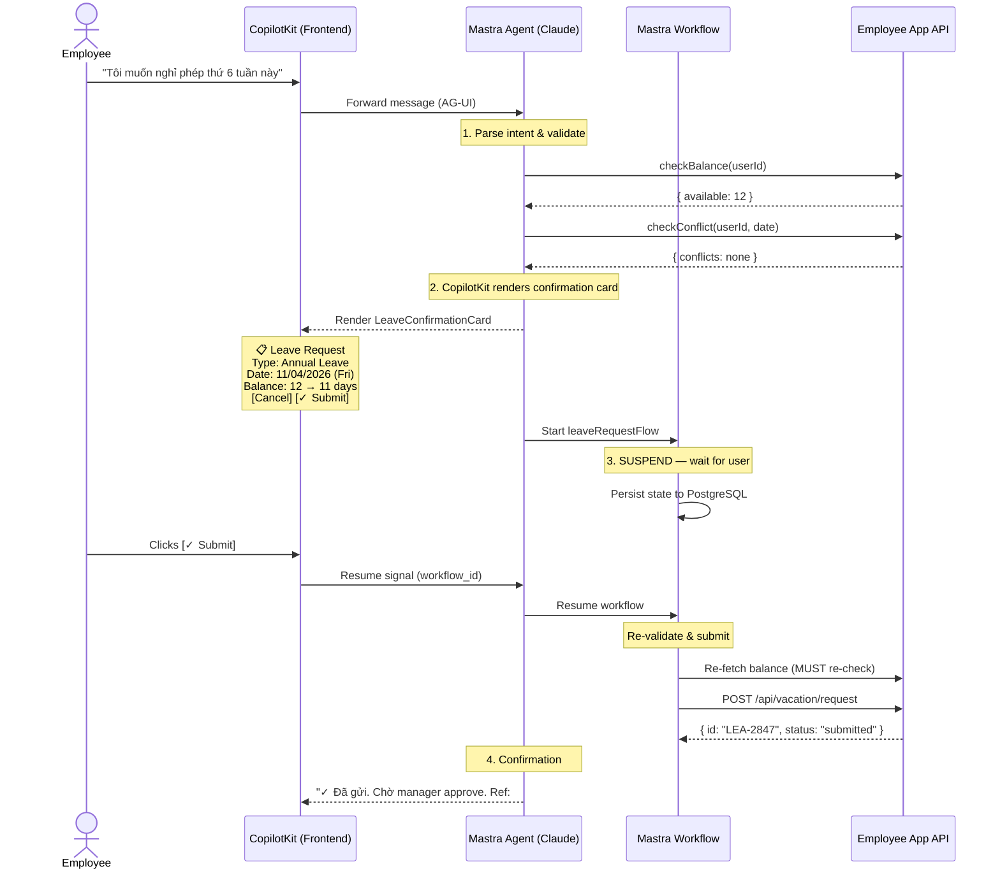
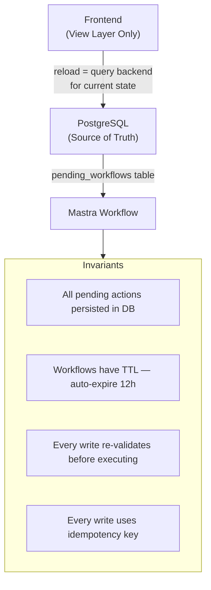

# Milestone 1 PRD: OpenWT Vacation Co-Pilot (MVP)

| Field | Value |
|-------|-------|
| Version | v1.0 |
| Date | 2026-04-08 |
| Status | DRAFT |
| Author | Luu Nguyen |

---

## Problem Statement

OpenWT employees (~200 people) spend unnecessary time navigating multiple pages and filling manual forms on the Employee App (employee.openwt.vn) to check vacation balances, submit leave requests, and find HR policy answers. Repetitive questions like "how many days do I have left?" burden both employees and HR. There is no intelligent assistance layer — just raw forms and wiki pages.

**Evidence**

- Developer (Luu) frequently asks the same leave-related questions — confirms this is a real daily friction
- Commercial HR AI assistants (Leena AI, Moveworks) report 70-80% query deflection, validating demand for this category
- Employee App already has the data (vacation balance, leave history, WFH records, devices) but no conversational interface to access it
- Current process requires 5-7 clicks to submit a single leave request

---

## Proposed Solution

An AI-powered chat widget (Vacation Co-Pilot) embedded directly into the Employee App, powered by Mastra + CopilotKit + Claude. It runs as a separate microservice alongside the existing NestJS backend — minimal frontend changes only (add CopilotKit widget). Phase 1 (MVP) focuses on core leave features: balance lookup, leave/WFH history, policy Q&A, submit leave requests, and Vision AI for document processing. Milestone 2 adds device info, Slack, attendance, profile, and more modules. This approach was chosen over modifying the existing NestJS app because Mastra does not support NestJS integration, and a separate service provides independent deploy/rollback with zero risk to the existing system.

### Key Hypothesis

We believe an AI chat assistant integrated into the Employee App will let employees get leave information instantly without navigating forms or asking HR. We'll know we're right when admin gives positive feedback and colleagues want to try it.

### What We're NOT Building

- **Payroll/salary queries** — different sensitivity level, separate compliance requirements
- **Mobile native app** — web widget is sufficient for MVP, mobile comes later
- **HR admin dashboard** — this is an employee-facing tool, not an HR management system
- **Full HRIS replacement** — Co-Pilot reads from the existing system, does not replace it
- **Custom LLM training** — using RAG over existing docs, not fine-tuning models

> **Future expansion:** This PRD covers Milestone 1 (Core) only. The full product roadmap spans 4 milestones with 18 features across all Employee App modules. See [product-roadmap.md](product-roadmap.md) for the complete roadmap.

---

## Success Metrics

| Metric | Target | How Measured |
|--------|--------|--------------|
| Demo impact | Admin gives positive feedback / approval to continue | Qualitative — demo session |
| Colleague interest | 3+ colleagues want to try it after demo | Count of opt-in requests |
| Query accuracy | 90%+ correct answers on vacation balance lookups | Manual spot-check during demo |
| Response time | < 3 seconds for balance queries | Measured during demo |
| System stability | Employee App unaffected by Co-Pilot deploy/crash | Monitor Employee App uptime during testing |

---

## Users & Context

**Primary User**
- **Who**: OpenWT employees (developers, PMs, admins) — Vietnamese software company, ~200 people
- **Current behavior**: Open Employee App, navigate to Attendance > Time-Off Requests, manually check balance, fill form fields, submit. For policy questions: search wiki or ask HR directly.
- **Trigger**: Need to check remaining vacation days, want to submit a leave request, or have a question about leave policy (carryover rules, sick leave requirements, WFH limits)
- **Success state**: Got the answer or completed the action in one chat interaction without leaving the current page

**Job to Be Done**
When I need to know my vacation balance or want to request time off, I want to ask in natural language and get an instant answer, so I don't have to navigate multiple pages, fill forms manually, or bother HR with repetitive questions.

**Non-Users**
- HR administrators — they use backend admin tools, not this employee-facing chat
- External users / clients — internal tool only
- Finance team (for payroll) — out of scope for MVP

---

## Requirements (MoSCoW)

### Core Capabilities

| Priority | Capability | Rationale |
|----------|------------|-----------|
| Must | Vacation balance lookup via chat | #1 most frequent query, core value proposition |
| Must | Leave history query | Employees need to see past requests and status |
| Must | HR policy Q&A (RAG) | Reduces repetitive questions to HR, high volume use case |
| Must | Submit leave request via chat | Key demo feature — conversational form filling with human-in-the-loop confirmation |
| Must | CopilotKit chat widget embedded in Employee App | Primary user interface |
| Must | Vietnamese language support | All employees are Vietnamese speakers |
| Must | Balance validation before submit | Re-fetch balance, check against policy constraints, prevent over-request |
| Must | Vision AI for document processing | Upload prescription or PM approval screenshot — AI extracts and pre-fills. Key demo feature (optional per request, but capability must exist in Phase 1) |
| Should | WFH history lookup | Related attendance feature, same API pattern |
| Could | Auto-fill leave forms via CopilotKit actions | Pre-populate form fields on the Employee App page |
| Won't | Payroll queries | Different compliance domain, explicitly deferred |
| Won't | Manager approval workflow | Existing approval flow stays in Employee App |
| Won't | Custom LLM fine-tuning | RAG over docs is sufficient and much simpler |

### Non-Functional Requirements

| Requirement | Target |
|-------------|--------|
| Response time | < 3 seconds for balance queries |
| System uptime | Employee App unaffected by Co-Pilot deploy/crash |
| Query accuracy | 80%+ correct answers across all query types |

---

## MVP Scope & User Flows

### MVP Scope (Phase 1)

Chat assistant that can **read and write**:

**Read (lookup + Q&A):**
1. Answer "How many vacation days do I have?" — calls Employee App API, presents balance
2. Answer "Show my leave history" — retrieves and displays past requests
3. Answer "Can I carry over unused days?" — RAG over HR policy documents
4. Answer "What's the WFH policy?" — RAG over HR policy documents
5. Respond in Vietnamese naturally

**Write (submit leave requests):**
6. Submit vacation/sick/personal leave request via conversational flow
7. Validate balance before submit (re-fetch realtime, check constraints)
8. Human-in-the-loop: show summary, user must confirm before submit
9. Vision AI (optional): upload prescription or PM approval screenshot → AI extracts dates/details → pre-fills request
10. Audit log every AI-submitted request

**Not in MVP:** Slack integration, auto-fill form on web page, proactive nudges.

**Guardrails for write operations:**
- Balance re-fetched immediately before every submit (never use cached data)
- User sees full summary and must explicitly confirm ("Yes" / "Edit" / "Cancel")
- If balance changed since last check, agent warns user before proceeding
- Image upload is always optional — user can type info manually
- Medical image consent popup (PDPD compliance)
- All submissions logged with userId, timestamp, tool name, AI-extracted data

### User Flows

**Flow 1: Balance lookup (read)**
```
Employee opens Employee App
    → Sees chat widget (bottom-right)
    → Types: "How many vacation days left?"
    → Co-Pilot calls API → streams response
    → "You have 17 days available (20/year, 9 taken, 6 carryover expiring June)"
```

**Flow 2: Submit leave via chat (write)**
```
Employee: "I want to take Thursday and Friday off next week"
    → Agent re-fetches balance: 17 days ✓
    → Agent: "Summary: Vacation, Thu-Fri Apr 10-11 (2 days). 
              Balance after: 15 days. Reason?"
    → Employee: "Family trip"
    → Agent: "Confirm submit? [Yes / Edit / Cancel]"
    → Employee: "Yes"
    → Agent calls POST /api/vacation/request
    → "Request #1921 submitted! Waiting for approval."
```

**Flow 2 — Detailed Architecture (Mastra + CopilotKit)**

The submit leave flow involves 3 layers working together: Mastra workflow (backend orchestration with suspend/resume), CopilotKit (frontend rendering of confirmation card), and the Employee App API (actual data operations).



**Mastra workflow breakdown:**
- **Step 1** — Validate & enrich: re-fetch balance, check team conflicts, prepare summary
- **Step 2** — Suspend: render confirmation card via CopilotKit, wait for user signal
- **Step 3** — Submit: only executes after user clicks [Submit], calls Employee App API

CopilotKit's `useCopilotAction` renders a real React component (not just text) inside the chat bubble — the confirmation card can include form fields, dropdowns, or date pickers if needed. See [research-report.md](research-report.md) Section 2 for implementation patterns.

**Flow 2a: User clicks [Edit] on confirmation card**
```
Agent shows confirmation card: "Vacation, Thu-Fri Apr 10-11 (2 days)"
    → Employee clicks [Edit]
    → Card switches to editable mode: date pickers + leave type dropdown + reason field
    → Employee changes dates to Wed-Thu Apr 9-10
    → Agent re-validates: checkBalance + checkConflict with NEW dates
    → Agent renders UPDATED confirmation card with new data
    → Employee clicks [Submit] → normal submit flow
```
The edit flow does NOT restart the conversation — it updates the existing Mastra workflow payload and re-renders the CopilotKit card with editable fields. The workflow stays SUSPENDED throughout.

**Flow 2b: Vietnamese date parsing**
```
Employee: "Tôi muốn nghỉ thứ 6 tuần sau"
    → Agent (Claude): interprets "thứ 6 tuần sau" = next Friday = 2026-04-18
    → Agent checks if 2026-04-18 is a public holiday or weekend
    → If holiday: "Ngày 18/04 là ngày lễ, bạn không cần xin nghỉ. Bạn muốn nghỉ ngày khác?"
    → If workday: normal confirmation flow

Employee: "Nghỉ từ 10 đến 14 tháng 4"
    → Agent: interprets as Apr 10-14 (Mon-Fri = 5 days)
    → Agent: excludes weekends automatically, counts only working days
    → Confirmation card shows: "5 working days (Mon 10/4 – Fri 14/4)"
```
Vietnamese date expressions Claude handles natively: "thứ 2-7", "tuần này/sau", "tháng sau", "ngày mai", "cuối tuần". Date format ambiguity (7/4 = April 7 in Vietnam, not July 4) is resolved by Vietnamese locale context in system prompt.

**Flow 3: Submit sick leave with prescription photo (write)**
```
Employee: "I'm sick, need sick leave"
    → Agent: "How many days? You can also upload a prescription (optional)"
    → Employee uploads prescription photo
    → Agent (Vision AI): extracts hospital, date, 2 days off
    → Agent: "From Family Hospital, 2 days. Confirm submit? [Yes / Edit / Cancel]"
    → Employee: "Yes"
    → Agent calls POST /api/vacation/request + attaches image
    → "Sick leave #1922 submitted with prescription attached!"
```

**Flow 3a: Vision AI extraction failure**
```
Employee uploads blurry/unreadable prescription
    → Agent (Vision AI): confidence < 0.6 OR missing required fields
    → Agent: "Tôi không thể đọc rõ ảnh. Bạn có thể:
              1. Chụp lại ảnh rõ hơn
              2. Nhập thông tin thủ công (tên bệnh viện, ngày, số ngày nghỉ)
              3. Bỏ qua ảnh và gửi đơn không đính kèm"
    → Employee chooses option → flow continues

Employee uploads non-medical image (e.g., selfie)
    → Agent (Vision AI): type = "unknown", confidence < 0.3
    → Agent: "Ảnh này không phải giấy tờ y tế. Bạn muốn tải ảnh khác hay nhập thông tin thủ công?"
```
Vision AI extraction always returns a `confidence` score. If < 0.6, agent asks user to verify or re-upload. Agent NEVER auto-fills from low-confidence extraction.

**Flow 4: RAG policy Q&A with escalation**
```
Employee: "Quy định về nghỉ phép khi có người nhà mất?"
    → Agent: searchPolicy("bereavement leave funeral family death") — attempt 1
    → No results (score < 0.5)
    → Agent: searchPolicy("nghỉ tang gia đình") — attempt 2 (Vietnamese)
    → No results
    → Agent: searchPolicy("special leave compassionate") — attempt 3
    → No results
    → Agent: "Tôi không tìm thấy thông tin về nghỉ tang trong chính sách hiện tại.
              Vui lòng liên hệ HR trực tiếp:
              • Email: hr@openwt.com
              • Slack: #hr-support
              HR sẽ hướng dẫn bạn quy trình cụ thể."
```
After 3 failed RAG attempts, agent provides specific HR contact info (not generic "contact HR"). This is the escalation path — no `escalateToHR()` tool needed, just system prompt instruction with concrete contact details.

### Scope Control

- **One feature at a time:** Each coding session focuses on exactly one task from the build plan. No scope creep — if a developer notices an improvement opportunity outside the current task, they log it as a note, not implement it.
- **Definition of Done per task:** A task is not "done" until:
  1. Code written
  2. `verify.sh` passes all layers (lint → type-check → unit → build)
  3. Manual smoke test confirms the feature works
  4. Commit pushed with descriptive message
- **Why:** AI coding agents (and humans) tend to drift scope when given broad instructions. Constraining to one feature per session prevents the "one-shot syndrome" (trying to build everything at once) and "scope creep" (fixing unrelated things).

---

## Edge Cases

Write operations (submit leave, Vision AI extraction) require careful handling of interrupted flows and concurrent state. These edge cases apply to all Hybrid features with "Careful" AI Readiness — see [product-roadmap.md](product-roadmap.md) Section 3.

| Edge Case | Problem | Solution |
|-----------|---------|----------|
| **Close browser mid-flow** | Mastra workflow suspended in DB, but frontend lost the confirmation card | On page reload: `GET /api/pending-actions?userId=xxx` → restore pending confirmation card. Workflow state persisted in PostgreSQL, frontend is just a view layer |
| **Network drop on submit** | User clicks Submit, request fails silently — unclear if submitted or not | Idempotency key per workflow ID. Retry UI with state check: query workflow status before re-submitting |
| **Double tab** | User opens 2 browser tabs, confirms in both | Idempotency key on workflow ID — second confirm returns "already submitted" |
| **Session timeout** | Auth token expires while confirmation card is displayed | Refresh token before resuming workflow. If refresh fails, re-authenticate without losing pending workflow state |
| **Stale data** | User sees "12 days balance" on card, but by confirm time another request was approved → now 11 days | **Re-validate at submit time** (Step 3 of Mastra workflow). If balance changed, show updated confirmation card instead of submitting |
| **Concurrent team leave** | 2 team members request same day, exceeding team minimum coverage | Backend checks team conflict at submit time (not at card render time). If conflict detected after card shown, warn and ask user to pick different date |
| **Partial info from user** | "Nghỉ tuần sau" — no specific date, no leave type | Agent must clarify before rendering confirmation card. Never guess or default silently |
| **Cancel then change mind** | User clicks Cancel, then says "thôi tôi muốn nghỉ thật" | Agent starts a new workflow — cancelled workflows are terminal, never resumed |
| **Orphaned workflows** | User never confirms, never returns | TTL on suspended workflows (e.g., 12 hours). Cron job expires orphaned workflows. No leave submitted |

**Architecture principle for edge cases:**



**Required infrastructure for pending workflow recovery:**

| Component | Purpose |
|-----------|---------|
| `pending_workflows` table | Store workflow_id, user_id, state (SUSPENDED/COMPLETED/EXPIRED), context snapshot (JSON), created_at, expires_at |
| `GET /api/pending-actions` | API endpoint for frontend to check on page load |
| Cron job | Expire orphaned workflows past TTL |
| Idempotency layer | Prevent duplicate submissions on retry |

---

## Technical Approach

**Feasibility**: HIGH

**Architecture Notes**
- Mastra + Hono as separate microservice on port :3001 (Employee App stays on :3000)
- Nginx reverse proxy on :443 routes `/api/*` → NestJS :3000, `/copilot/*` → Mastra :3001 — browser only talks to one origin, avoids CORS issues
- CopilotKit React widget embedded in Employee App React source (Option A — shared auth context)
- Claude Haiku for routine chat, Claude Sonnet for Vision AI (document extraction in Phase 1)
- RAG: Recursive chunking (500 tokens, 100 overlap), pgvector in PostgreSQL, metadata filtering by category. RAG exposed as agent Tool — agent auto-loops up to 3 times with different queries if first search doesn't return enough info. RAG loop is invisible to user — agent streams "Searching..." indicator while looping
- PostgreSQL for AI memory + audit logs, Redis for cache + conversation state
- Docker Compose deployment on OpenWT infrastructure
- **RBAC scalability:** Architecture supports admin/manager roles without re-architecture. Same widget, same backend — role detected from JWT, tools and prompt adjust per role, Employee App API enforces authorization. See [research-report.md](research-report.md) Section 9.4 for details
- Mastra abstraction layer to enable fallback to raw Claude SDK if needed
- **Implementation details:** Tool Zod schemas ([research-report.md](research-report.md) Section 7), system prompt template (Section 9), CopilotKit integration patterns (Section 2), observability with Langfuse (Section 10)
- **Foundational concepts:** Agent memory, RAG, guardrails, HITL patterns — see [ai-agent-fundamentals.md](ai-agent-fundamentals.md)

**Auth & CSRF** — See [Appendix: Phase 1 Discovery Decision Matrix](#appendix-phase-1-discovery-decision-matrix) for all auth scenarios (JWT/cookie/session/OAuth) and CSRF handling. Implementation code in [research-report.md](research-report.md) Section 3.

**Image Storage (Vision AI)**
- Uploaded images stored in local Docker volume (`/data/uploads/`) with UUID filenames
- Retention: 30 days, then auto-deleted by cron job
- Max file size: 10MB (enforced by CopilotKit `maxFileSize` config)
- Accepted formats: JPEG, PNG, PDF
- Images are NOT sent to Claude as base64 — they are stored locally, and a pre-signed internal URL is passed to the Vision API
- PII in images: after extraction, the structured data is stored in audit log, but the raw image is NOT included in conversation memory. Image URL is stored only in the audit record
- See [research-report.md](research-report.md) Section 4 for Vision AI details

**Audit Log Access Control**
- Audit logs stored in `audit_log` table in Co-Pilot DB (not Employee App DB)
- Access: only system admin can query audit logs directly (no UI in Phase 1)
- Manager sees only structured leave request data via Employee App — NOT the AI-extracted image or conversation history
- Phase 2: HR admin dashboard can surface audit log entries with appropriate RBAC

**Key Technical Decisions (from Council)**

| Decision | Choice | Rationale |
|----------|--------|-----------|
| Agent framework | Mastra + Hono | TypeScript-first, durable workflows, but no NestJS support |
| Chat UI | CopilotKit | Official Mastra integration, AG-UI protocol, saves weeks |
| LLM provider | Claude cloud API | Best Vietnamese support, $50-100/month, no GPU needed |
| MVP scope | Read + Write (with guardrails) | Submit leave is the key demo feature. Human-in-the-loop + balance validation mitigate risk |
| Auth (Phase 1) | Passthrough JWT + pre-action balance validation | JWT sufficient for Phase 1. Write safety via re-fetch + confirmation + audit log |

---

## Security

These security considerations are documented for awareness. Phase 1 is an internal demo for ~200 employees — risk tolerance is higher than a public-facing product. Phase 2 must address all HIGH items before wider rollout.

| Item | Phase 1 Approach | Phase 2 Upgrade |
|------|-----------------|-----------------|
| JWT signing | Symmetric (shared secret) — accept risk | RS256 asymmetric (Mastra gets public key only) |
| JWT storage | Employee App's existing mechanism (localStorage or cookie) | Prefer HttpOnly cookie if possible |
| Body size limit | CopilotKit frontend limit (10MB) + **Hono middleware (12MB server-side)** | Same |
| SSRF on Vision URL | Server-generated UUID paths only — never from user input. Validate against `/data/uploads/{uuid}` pattern | Same |
| Docker network | Single bridge network (simple) | Segment: frontend network (nginx↔Mastra) + backend network (Mastra↔DB↔Redis) |
| Medical data to Anthropic cloud | Consent popup + PII redaction + optional upload | Zero-retention API + PDPD legal review |
| Prompt injection | System prompt constraints + scope enforcement | Add Mastra input processor or rule-based pre-filter |
| CopilotKit widget failure | Remove 3-5 lines to rollback | **Add runtime feature flag** — disable widget without code deploy |
| PostgreSQL backup | Docker volume only | Daily pg_dump cron + off-site backup |
| Redis conversation isolation | Per-user Mastra memory | Enforce key namespacing `conv:{userId}:{sessionId}` + 8h TTL |
| Nginx connection limits | Basic config | Add `limit_conn` + `limit_req` directives to `/copilot/` location |

---

## Implementation Phases

| Phase | Name | What | Effort | Depends |
|-------|------|------|--------|---------|
| **1** | **Discovery** | Audit Employee App: API endpoints, auth mechanism, frontend stack, deployment environment | 1 day | — |
| **2** | **Knowledge Base** | Export HR policies from wiki + Company Regulations, normalize to markdown. Audit BE/FE source code to determine integration approach | 1-2 days | Phase 1 |
| **3** | **MVP Build** | Infra → Read tools → RAG → Write + HITL → Vision AI → Testing → Demo | 2-3 weeks | Phase 1, 2 |

### Phase 1: Discovery (1 day)

- **Goal**: Determine exactly how the Employee App works — eliminate all assumptions
- **How**: Open browser DevTools → Network tab, Application tab, Sources tab
- **Output**: Set `.env` config (AUTH_MODE, API_FORMAT, JWT claims, etc.)
- **Checklist**: See [Appendix: Phase 1 Discovery Decision Matrix](#appendix-phase-1-discovery-decision-matrix) for all scenarios

### Phase 2: Knowledge Base (1-2 days)

- **Goal**: Prepare data for RAG + understand BE/FE source code for integration
- **Scope**:
  - Export HR policies from employee.openwt.vn/wiki → normalize to structured markdown files
  - Export Company Regulations content (already structured in app)
  - Audit BE source code: confirm API endpoints, auth middleware, CSRF config, response format
  - Audit FE source code: confirm state management, router, auth context, CopilotKit mount point
  - If BE/FE has non-standard implementations → find specific integration solutions before building
- **Deliverables**:
  - `docs/policies/` folder: leave policy, WFH policy, holidays, approval flow
  - BE/FE integration notes: exact mount point, auth hook name, API response schemas
- **Success signal**: All policies in markdown + exact integration approach documented

### Phase 3: MVP Build (2-3 weeks)

- **Goal**: Working chat widget — balance lookup, policy Q&A, submit leave, Vision AI
- **Scope**:
  - Mastra + Hono + PostgreSQL + Redis (Docker Compose)
  - Mastra abstraction layer (fallback-ready)
  - **Read tools:** `getVacationBalance`, `getVacationHistory`, `getWFHHistory`
  - **Write tools:** `submitLeaveRequest` (vacation, sick, personal) with pre-action balance validation
  - **Vision AI:** `extractDocument` — process prescription photos, PM approval screenshots (optional upload, Claude Sonnet)
  - **RAG:** Ingest HR policy documents from Phase 2, searchPolicy tool with agentic loop
  - CopilotKit React widget embedded in Employee App
  - Streaming responses via AG-UI protocol
  - Auth: based on Phase 1 discovery (config switch, no code change needed)
  - **Guardrails for write operations:**
    - Human-in-the-loop: summary → confirm/edit/cancel before submit
    - Balance re-fetched realtime before every submit (never cached)
    - If balance changed since last check, warn user
    - Consent popup for medical image upload (PDPD)
    - Audit log every AI-submitted request (userId, timestamp, tool, data)
    - Image upload always optional
- **Success signal**: Demo to admin — (1) ask vacation balance, correct answer in < 3 seconds; (2) submit leave request via chat with confirmation; (3) upload prescription, AI extracts info, submits sick leave
- **Estimated effort**: 2-3 weeks. See [m1-feasibility.md](m1-feasibility.md) for detailed build sequence

### Sequencing

Phase 1 (Discovery) → Phase 2 (KB) → Phase 3 (Build) are sequential. Phase 1 must complete before Phase 2 (need to know API format before structuring KB). Phase 2 must complete before Phase 3 (RAG needs clean data, integration approach must be clear). Phase 3 demo must pass before committing to Milestone 2.

### Blockers — Must confirm with admin/devops BEFORE starting

These are the only items that can completely block the project. No technical fallback exists if access is denied.

- [ ] **Employee App frontend repo access** — to add CopilotKit widget (3-5 lines of code). Without this, cannot embed the chat widget
- [ ] **Employee App backend repo access** — needed if existing API endpoints are missing or need CORS config
- [ ] **Server/machine to run Docker Compose** — any Linux/Mac on OpenWT network with Docker installed

If all 3 are confirmed → no remaining blockers. All other risks have documented fallbacks.

### Developer Onboarding (AGENTS.md)

- When starting Phase 3 (MVP Build), create an `AGENTS.md` file at the repo root.
- This file is the first thing any developer or AI coding agent reads before starting work.
- **Contents:** project overview, tech stack summary, coding conventions, file structure, available tools (scripts, verify commands), and what NOT to do.
- **Purpose:** Eliminates "context drift" — where decisions made in early sessions are forgotten or contradicted in later sessions. Every session starts from the same shared context.
- The repo becomes a "system of record" — all knowledge needed to continue work is embedded in the repository itself, not in someone's memory or a chat history.

---

## Risks & Mitigations

| Risk | Likelihood | Mitigation |
|------|------------|------------|
| Mastra breaking changes (v1.3, volatile) | Medium | Abstraction layer, pin versions, test upgrades in CI |
| CopilotKit conflicts with existing React app | Low | Test embedding early in Phase 1, fallback to Vercel AI SDK |
| Employee App API undocumented / changes | Medium | Map APIs via DevTools first (Phase 1 (Discovery)), build resilient error handling |
| HR policy data too messy for RAG | Medium | Phase 1 (Discovery) policy cleanup, manual curation before ingestion |
| Dependency diamond (Mastra + CopilotKit release sync) | Low | Pin both versions, upgrade only when tested together |
| PDPD compliance for medical docs | Medium | Consent popup, PII redaction, audit trail. Image upload is optional. Full PDPD review before Phase 2. See Decisions Log section (Decision 3) |
| AI submits wrong leave request | Medium | Human-in-the-loop confirmation, balance re-fetch before submit, audit log for rollback |
| **Mastra workflow + CopilotKit suspend/resume untested** | **High** | **This exact integration pattern (Mastra suspend → CopilotKit card → resume) is not documented by either framework. MUST prototype in Week 1 before building on top. Fallback: implement confirmation via chat text (Yes/No) instead of UI card** |
| CopilotKit `onError` API unverified | Medium | Verify CopilotKit exposes HTTP status in error callbacks during Phase 1 (Discovery). Fallback: custom fetch wrapper around CopilotKit's runtime URL |
| JWT shared signing secret (symmetric) | Medium | Phase 1: accept risk (internal tool, ~200 users). Phase 2: migrate to RS256 asymmetric (Mastra holds public key only). See [Security](#security) section |

---

## Decisions Log


### Decision Summary

| # | Decision | Choice | Risk to Watch |
|---|----------|--------|---------------|
| 1 | Agent Framework | Mastra + Hono, wrap with abstraction layer | Mastra breaking changes (v1.3, volatile) |
| 2 | Chat UI | CopilotKit, pin versions strictly | Dependency diamond (Mastra + CopilotKit sync) |
| 3 | LLM Provider | Claude cloud (Haiku + Sonnet) + PII redaction | Medical docs require PDPD compliance |
| 4 | MVP Scope | Read + Write Phase 1 (expanded from read-only) | Write operations need guardrails |
| 5 | Auth Strategy | Passthrough Phase 1, scope-limited Phase 2 | Prompt injection + write = privilege escalation |
| 6 | Deployment | Docker Compose on-premise | HR data sensitivity |
| 7 | Policy Data | RAG over wiki export | Data quality |

### Decision Details

**1. Mastra + Hono (separate service)**
- Use Mastra standalone with abstraction layer for Claude SDK fallback
- **Dissent (Skeptic):** Phase 1 only needs NestJS + Claude SDK. Mastra truly needed only for durable workflows
- **Counter:** Switching frameworks mid-project costs more than starting with the right one

**2. CopilotKit**
- AG-UI protocol + Mastra starter template saves weeks. Fallback: Vercel AI SDK
- Pin versions strictly. Test upgrades in CI before deploying

**3. Claude Cloud API**
- Haiku for routine queries, Sonnet for Vision. Do not self-host ($8K-15K GPU for worse quality)
- **PDPD guardrails (Phase 1):** consent popup, PII field-level redaction, audit trail, image upload optional
- **Phase 2:** Explore Anthropic zero-retention API, PDPD legal review for cross-border medical data
- **Risk acceptance:** Phase 1 sends images to Anthropic cloud (US). If legal blocks, Vision AI can be disabled via feature flag

**4. MVP Scope — Read + Write**
- **Original council verdict:** Read-only. **Updated:** expanded to include write (submit leave + Vision AI)
- Rationale: "upload prescription → AI fills form → confirm → submitted" is 10x more impressive than "check balance"
- **Council's concern** ("one bad AI-submitted request kills trust") addressed by human-in-the-loop — AI never auto-submits

**5. Auth Strategy**
- **Phase 1:** Passthrough JWT + balance re-fetch before every write
- **Phase 2:** Service account with user context — AI credential + `X-On-Behalf-Of: userId` + endpoint allowlist
- **Why not OAuth2:** Overkill for ~200 person internal tool
- **Why not JWT claim restriction:** AI backend becomes token issuer = high-value attack target
- **RBAC scalability:** Architecture supports admin/manager roles without changes — JWT role claim → Mastra loads role-appropriate tools → API enforces authorization

### Critical Action Items

**Before coding:**
1. Phase 1 (Discovery): Policy KB Cleanup — export from employee.openwt.vn/wiki, normalize to markdown with metadata

**During Phase 1:**
2. Mastra Abstraction Layer — wrap APIs for Claude SDK fallback
3. Pin CopilotKit + Mastra versions

**Before Milestone 2:**
4. Scope-limited service account for stronger auth
5. PDPD compliance review with legal team

---

## Open Questions

**Resolved:**
- [x] ~~Do we have access to modify Employee App frontend code?~~ **Yes.** Option A — embed CopilotKit directly into Employee App React source. Widget shares auth context.
- [x] ~~Milestone 2 auth design?~~ **Service account with user context** — see Decisions Log (Decision 5).

**To resolve during Phase 1 (Discovery) — requires browser DevTools:**
- [ ] What are the exact Employee App API endpoints? (REST or GraphQL?)
- [ ] What authentication mechanism does the Employee App use (JWT, session cookies, OAuth)?
- [ ] Where is the token stored? (localStorage, sessionStorage, HttpOnly cookie?)
- [ ] What JWT claims exist? (Does it contain `userId`, `role`, `sub`?)
- [ ] Is JWT symmetric (HMAC-SHA256) or asymmetric (RS256)?
- [ ] Does the Employee App have a token refresh mechanism?
- [ ] Does NestJS enforce CSRF on POST endpoints? If yes, how?
- [ ] What frontend state management is used? (Context API, Redux, Zustand, Jotai?)
- [ ] What build system? (Webpack, Vite, Next.js?)
- [ ] What router? (React Router, Next.js App Router, Tanstack Router?)
- [ ] Is there an existing reverse proxy (nginx, Apache, Caddy, CloudFlare)?
- [ ] Is Docker available on the deployment server?
- [ ] Are ports 3001, 5432, 6379 available?
- [ ] Is the Employee App database PostgreSQL or MySQL?
- [ ] Is SSL/TLS already configured for employee.openwt.vn?

**To resolve during implementation:**
- [ ] Is the HR policy data on employee.openwt.vn/wiki clean enough for RAG ingestion?
- [ ] Can CopilotKit widget embed into the existing Employee App React frontend without conflicts?
- [ ] Where to store uploaded images (local disk, S3-compatible, or PostgreSQL bytea)? What retention policy?

---

## Related Documents

| Document | Purpose |
|----------|---------|
| [research-report.md](research-report.md) | Implementation research: tool schemas (Section 7), system prompt (Section 9), CopilotKit patterns (Section 2), observability (Section 10) |
| [ai-agent-fundamentals.md](ai-agent-fundamentals.md) | Foundational concepts: agent memory (Section 2), RAG (Section 4), guardrails (Section 5), HITL (Section 7) |
| [product-roadmap.md](product-roadmap.md) | Full 4-milestone roadmap (18 features) |
| [m1-feasibility.md](m1-feasibility.md) | Phase 1 build order, cost estimate, prerequisites |
| [tech-stack-analysis.md](../references/tech-stack-analysis.md) | Analysis of 18 AI agent frameworks |

---

## Appendix: Phase 1 Discovery Decision Matrix

Every integration point has multiple possible scenarios. Phase 1 (Discovery) must identify which scenario is real, then follow the corresponding solution path. See [research-report.md](research-report.md) §7.1 for implementation code per scenario.

### Auth Mechanism

| Scenario | CopilotKit Integration | Mastra Validation | Effort Impact |
|----------|----------------------|-------------------|---------------|
| **A: JWT in localStorage** (most likely) | `headers: { Authorization: \`Bearer \${localStorage.getItem('token')}\` }` | Verify JWT signature, extract claims | Baseline (0 extra days) |
| **B: JWT in sessionStorage** | Same as A, but `sessionStorage.getItem('token')` | Same as A | Baseline |
| **C: JWT in HttpOnly cookie** | Widget CANNOT read token via JS. Solution: CopilotKit sends requests with `credentials: 'include'` → cookie sent automatically. Mastra reads from cookie header, not Authorization | Mastra extracts JWT from `Cookie` header instead of `Authorization` | +0.5 days |
| **D: Session cookie (no JWT)** | `credentials: 'include'` sends session cookie. No Bearer token | Mastra forwards session cookie to Employee App API. Cannot validate locally — must call Employee App `/api/me` to get userId | +1-2 days (need session proxy pattern) |
| **E: OAuth2 tokens** | Use OAuth token from Employee App's auth provider. `headers: { Authorization: \`Bearer \${oauthToken}\` }` | Validate with OAuth provider's JWKS endpoint, or introspect token | +1 day |

**Fallback if auth mechanism is unexpected:** Add a `/copilot/auth-probe` endpoint in Mastra that accepts any request from the widget and inspects what auth artifacts arrive (headers, cookies). Run this first to discover the mechanism.

### JWT Claims

| Scenario | Impact | Solution |
|----------|--------|----------|
| **JWT has `sub` (userId) + `role`** | Ideal — direct extraction | `const { sub, role } = verify(token, secret)` |
| **JWT has `userId` but no `role`** | RBAC won't work from JWT alone | Call Employee App `/api/me` to get role, cache for session duration |
| **JWT has neither** | Cannot identify user from token | Call Employee App `/api/me` on every request (expensive) or extract from token's custom claims |
| **JWT uses non-standard claim names** | Code breaks silently | Make claim names configurable: `JWT_USER_CLAIM=sub`, `JWT_ROLE_CLAIM=role` in .env |

### JWT Signing

| Scenario | Mastra Config | .env |
|----------|--------------|------|
| **HMAC-SHA256 (symmetric)** | `verify(token, JWT_SECRET)` | `JWT_SECRET=<shared-secret>` |
| **RS256 (asymmetric)** | `verify(token, publicKey, { algorithms: ['RS256'] })` | `JWT_PUBLIC_KEY_PATH=/certs/public.pem` |
| **Unknown** | Try RS256 first (safer), fallback to HMAC | Provide both options in .env |

### API Format

| Scenario | Tool Implementation | Effort Impact |
|----------|-------------------|---------------|
| **REST (expected)** | `fetch(url, { method, headers, body })` as documented | Baseline |
| **GraphQL** | Replace all tools with GraphQL queries: `fetch(url, { body: JSON.stringify({ query, variables }) })` | +2-3 days (rewrite all 7 tools) |
| **Mixed (REST + GraphQL)** | Some tools use REST, some use GraphQL | +1-2 days |

**Detection:** In Phase 1 (Discovery) DevTools audit, check Network tab. If requests go to a single `/graphql` endpoint with POST body, it's GraphQL. If multiple `/api/*` endpoints with different HTTP methods, it's REST.

### CSRF

| Scenario | Mastra Behavior | Implementation |
|----------|----------------|----------------|
| **No CSRF (Bearer exempt)** | Send `Authorization: Bearer` header, no CSRF needed | Baseline |
| **CSRF required on all POST** | Mastra must fetch CSRF token before each write operation | GET `/api/csrf-token` → include `X-CSRF-Token` header on POST |
| **CSRF via double-submit cookie** | Mastra reads CSRF cookie, sends as header | `const csrf = cookieJar.get('XSRF-TOKEN'); headers['X-XSRF-TOKEN'] = csrf` |
| **CSRF not applicable (cookie-less)** | If auth is Bearer-only with no cookies, CSRF is irrelevant | No action needed |

### Frontend Integration

| Scenario | CopilotKit Mount Point | Considerations |
|----------|----------------------|----------------|
| **React + Context API auth** | Wrap `<CopilotKit>` inside existing `<AuthProvider>`, call `useAuth().getToken()` | Simplest path |
| **React + Redux auth** | Import store, call `store.getState().auth.token` in CopilotKit headers callback | Must not trigger re-renders |
| **React + Zustand auth** | `useAuthStore.getState().token` (non-reactive access for headers) | Works outside React components |
| **Next.js App Router** | Mount in root `layout.tsx`, use `useSession()` from next-auth if applicable | Verify CopilotKit SSR compatibility |
| **React Router (SPA)** | Mount in `App.tsx` root, widget persists across routes | Standard approach (documented) |

### Reverse Proxy / Deployment

| Scenario | Solution | Effort Impact |
|----------|---------|---------------|
| **No existing reverse proxy** | Add nginx to Docker Compose (as documented) | Baseline |
| **Already has nginx** | Add `/copilot/` location block to existing nginx config | Less effort, but need config access |
| **Behind CloudFlare / CDN** | Configure CloudFlare to route `/copilot/*` to Mastra origin | Need CloudFlare admin access |
| **Behind Apache** | `ProxyPass /copilot/ http://localhost:3001/` in Apache config | Different syntax, same concept |
| **No reverse proxy + no Docker** | Run Mastra directly on host, use CORS headers for cross-origin | +1 day (CORS config needed) |

### Database

| Scenario | Impact | Solution |
|----------|--------|---------|
| **PostgreSQL available** | Ideal — use pgvector for RAG embeddings | Baseline |
| **Only MySQL available** | pgvector unavailable | Use separate SQLite + vector extension for embeddings, or Pinecone/Qdrant cloud |
| **Shared PostgreSQL (no separate DB allowed)** | Must use existing DB | Create `copilot_` prefixed tables in existing DB, request schema access |

---

*Generated: 2026-04-06 | Updated: 2026-04-08*
*Status: DRAFT - needs validation*
