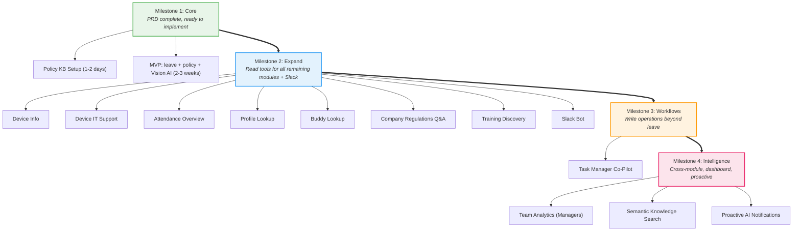

# OpenWT Employee Co-Pilot — Product Roadmap

| | |
|---|---|
| **Version** | 1.0 |
| **Updated** | 2026-04-09 |
| **Status** | Planning complete |
| **Features** | 18 across 4 milestones |

## Vision

Transform OpenWT's Employee App from a passive portal into an **AI-native workspace** where employees manage leave, devices, training, and company knowledge through a single conversational interface — reducing clicks, eliminating repetitive HR questions, and enabling proactive assistance.

**Expansion principle:** The Mastra + CopilotKit infrastructure built in Milestone 1 is reusable for all subsequent milestones. Each new feature = add tools + expand RAG. No re-architecture needed.

---

## 1. Roadmap Overview

---

## 2. Milestone Details

### Milestone 1: Core — Vacation Co-Pilot

> **Status:** PRD complete, ready to implement. Full details in [m1-prd.md](m1-prd.md), build order in [m1-feasibility.md](m1-feasibility.md).

Establishes core AI infrastructure: Mastra + Hono backend, CopilotKit widget, Claude API, PostgreSQL + Redis, RAG pipeline, Docker Compose deployment. All subsequent milestones build on this foundation.

| Phase | Deliverables | Effort |
|-------|-------------|--------|
| **Phase 1: Discovery** | Audit Employee App: API endpoints, auth mechanism, frontend stack, deployment | 1 day |
| **Phase 2: Knowledge Base** | Export HR policies from wiki + audit BE/FE source code for integration approach | 1-2 days |
| **Phase 3: MVP Build** | Balance lookup, leave/WFH history, policy Q&A, submit leave, Vision AI, audit logging | 2-3 weeks |

---

### Milestone 2: Expand — Read Tools for All Modules + Slack

> Read-only lookups across all remaining Employee App modules. Same AI engine, just add new tools and RAG content. No new write operations.

| Feature | User asks | Implementation | Module | Effort |
|---------|----------|---------------|--------|--------|
| **Device Info Query** | "Laptop serial number?" / "Devices assigned to me?" | Tool `getDeviceInfo(userId)` | Device | 0.5 day |
| **Device IT Support** | "MacBook slow, who to contact?" / "Warranty status?" | Enhance `getDeviceInfo` + RAG over IT policies | Device | 2-3 days |
| **Attendance Overview** | "Hôm nay check-in lúc mấy giờ?" / "Tuần này làm bao nhiêu giờ?" | Tool `getAttendanceOverview(userId, dateRange)` | Attendance | 1-2 days |
| **Profile Lookup** | "Skills của tôi?" / "Employment history?" / "Certifications?" | Tools `getProfile`, `getSkills`, `getEducation`, `getCertifications` | Profile | 2-3 days |
| **Buddy Lookup** | "Who is my buddy?" / "My buddees?" | Tools `getBuddyInfo`, `getMyBuddees` — read-only | Buddy | 1-2 days |
| **Company Regulations Q&A** | Any company regulation (working hours, performance, salary...) | RAG over Company Regulations content (already structured in app) | Company Regs | 1-2 days |
| **Training Discovery** | "Trainings của tôi?" / "TOEIC Test status?" | Tool `getMyTrainings(userId)` | Training | 2-3 days |
| **Slack Bot** | Same AI, accessible from Slack | Slack webhook → shared Mastra backend | External | 3-5 days |

**Milestone 2 total: ~2-3 weeks.** All features reuse Milestone 1 infra — only new tools, RAG content, and Slack integration needed.

---

### Milestone 3: Workflows — Write Operations Beyond Leave

> Write operations that modify data in Employee App (beyond leave requests already in Milestone 1). Requires human-in-the-loop confirmation patterns from Milestone 1.

| Feature | User asks / does | Implementation | Module | Effort |
|---------|-----------------|---------------|--------|--------|
| **Task Manager Co-Pilot** | "My tasks?" / "Mark X done" / "What's overdue?" / "Tasks with priority High?" | Tools `getTasks`, `updateTaskStatus` + filtering by status/priority/label. Write op: update task status requires HITL confirm | Tasks | 5-7 days |

**Milestone 3 total: ~1-2 weeks.** Reuses HITL confirmation patterns from Milestone 1 submit leave flow.

---

### Milestone 4: Intelligence

> Cross-module orchestration, proactive behavior, role-based features. Each feature is 2-4 weeks.

| Feature | Description | Key Dependency | Effort (weeks) |
|---------|------------|---------------|----------------|
| **Team Analytics (Managers)** | Team leave summaries. RBAC already supported — see [research-report.md](research-report.md) §9.4 | Aggregation APIs + dashboard UI | 2-3 weeks |
| **Semantic Knowledge Search** | Natural language search across ALL internal docs | Hierarchical RAG + hybrid search | 2-3 weeks |
| **Proactive AI Notifications** | "Leave expires in 2 weeks" / "Overtime detected" / "Warranty expiring" | Scheduled Mastra workflows + push routing | 3-4 weeks |

**Milestone 4 total: ~7-10 weeks.** Requires new UI components (dashboard) and advanced RAG techniques. Can be parallelized if multiple developers are available.

---

## 3. Feature Matrix

| # | Feature | M | Fitness | AI Readiness | Interface |
|---|---------|------|---------|--------------|-----------|
| 1 | Vacation Balance Lookup | 1 | **Chat** | Ready | Pure chat |
| 2 | Leave History Query | 1 | **Hybrid** | Ready | Chat card + "View all" link |
| 3 | HR Policy Q&A (RAG) | 1 | **Chat** | Ready | Chat with source citation |
| 4 | WFH History Lookup | 1 | **Hybrid** | Ready | Chat card + "View all" link |
| 5 | Submit Leave Request | 1 | **Hybrid** | Careful | Chat → summary → confirm → submit |
| 6 | Vision AI Documents | 1 | **Hybrid** | Careful | Upload (optional) → preview → confirm |
| 7 | Device Info Query | 2 | **Chat** | Ready | Pure chat |
| 8 | Device IT Support | 2 | **Hybrid** | Careful | Chat FAQ → IT ticket if unresolved |
| 9 | Attendance Overview | 2 | **Chat** | Ready | Pure chat |
| 10 | Profile Lookup | 2 | **Chat** | Ready | Pure chat |
| 11 | Buddy Lookup | 2 | **Chat** | Ready | Pure chat |
| 12 | Company Regulations Q&A | 2 | **Chat** | Ready | Chat with source citation |
| 13 | Training Discovery | 2 | **Chat** | Ready | Pure chat |
| 14 | Slack Bot | 2 | **Chat** | Ready | Slack native |
| 15 | Task Manager | 3 | **Hybrid** | Careful | Chat queries + updates (write) |
| 16 | Team Analytics | 4 | **UI-first** | Not suited | Dashboard. Chat as optional entry |
| 17 | Knowledge Search | 4 | **Chat** | Careful | Chat with source links |
| 18 | Proactive Notifications | 4 | **Chat** | Not suited | Chat nudge / Slack DM |

**Summary:** 11 Chat / 6 Hybrid / 1 UI-first / 0 No-go (18 features: 6 MVP + 8 Milestone 2 + 1 Milestone 3 + 3 Milestone 4)

**Multi-Language:** Vietnamese/English support is built-in from Phase 1 — Claude handles both natively. System prompt instruction "respond in same language as user" is all that's needed. No separate milestone or effort required.

### AI Readiness Legend

| Rating | Meaning | Criteria |
|--------|---------|----------|
| **Ready** | Build now with AI agent | Read-only, low risk, text response sufficient |
| **Careful** | AI agent viable with safeguards | Write operations or data extraction — requires human confirmation step |
| **Not suited** | AI agent is wrong primary interface | High-stakes decisions, data-heavy dashboards, sensitive data, or proactive push — use traditional UI with optional AI entry point |

---

## 4. Module Coverage

| Module | Milestone 1 (MVP) | Milestone 2 | Milestone 3 | Milestone 4 |
|--------|-------------|--------|--------|--------|
| **Profile** | — | Lookup (CV, Skills, Education, Certs) | — | Team Analytics |
| **Training** | — | My Trainings, TOEIC | — | — |
| **Attendance** | — | Overview (check-in/out, hours) | — | — |
| **Leave/WFH** | Balance, History, WFH, Leave Submit, Vision AI | — | — | — |
| **Device** | — | Info Query + IT Support | — | — |
| **Cross-module** | — | — | — | Proactive Notifications |
| **Buddy** | — | My Buddy, My Buddees | — | — |
| **Tasks** | — | — | Task Manager (write) | — |
| **Company Regs** | HR Policy Q&A | All Regulations | — | Semantic Search |
| **External** | — | Slack Bot | — | — |

---

## Related Documents

| Document | Purpose |
|----------|---------|
| [m1-prd.md](m1-prd.md) | Milestone 1 PRD (MVP scope, user flows, edge cases, decisions) |
| [m1-feasibility.md](m1-feasibility.md) | Milestone 1 feasibility, build order, cost estimate |
| [research-report.md](research-report.md) | Technical research (implementation details) |
| [ai-agent-fundamentals.md](ai-agent-fundamentals.md) | AI agent concepts reference |
